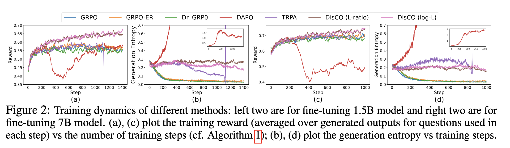

<h1 align="center">🚀 DisCO: Reinforcing Large Reasoning Models with Discriminative Constrained Optimization</h1>
<!--<p align="center"></p> 
<p align="center" tyle="font-size: 5px;"><em>Credit: the above image was generated by Sora</em></p>-->

📢 **[Oct 2025]:**
Building on DisCO framework, we developed an **efficient reasoning** method that achieves **77% length reduction** with only
1.1% performance loss on simple GSM8k dataset using a 1.5B model, compared with DisCO's strong performance. Refer to [Paper](https://www.arxiv.org/abs/2510.04474) and [Code](https://github.com/Optimization-AI/DRPO).

**[Sep 2025]:**
Our paper "DisCO: Reinforcing Large Reasoning Models with Discriminative Constrained Optimization" has been **accepted at NeurIPS 2025** 🎉.

**[Sep 2025]:**
To help utilize our work with **latest versions of vLLM and Verl**, we’ve opened a pull request in the Verl repository. Feel free to check it out! [Pull Request](https://github.com/volcengine/verl/pull/3357)

---

Paper link: [arXiv](https://arxiv.org/abs/2505.12366)


The success of **DeepSeek-R1** has spotlighted **GRPO (Group Relative Policy Optimization)** as a key reinforcement learning method for large reasoning models.
However, GRPO suffers several key limitations including entropy collapse, difficulty bias, etc. 

*How can we design more effective optimization methods for reinforcing large reasoning models
in a principled manner without inheriting the limitations of GRPO?*


We analyzed GRPO and its variants (Dr. GRPO, DAPO, etc) under a binary reward setting and uncovered two core insights:

* ⚠️ GRPO suffers from **question-level difficulty bias** for its discriminative objective
* 🔍 GRPO has a surprising connection to **discriminative learning** techniques, particularly AUC maximization

---

### 💡 Introducing **DisCO** — *Discriminative Constrained Optimization*

**DisCO** is a new RL framework grounded in **discriminative learning**. It trains models by **increasing scores for positive answers while decreasing those for negatives**, enabling:

* ⚡ Faster convergence
* 🔒 More stable optimization
* 🔁 Long-lasting training dynamics

---

### 🔍 Why DisCO?

* ❌ **No more difficulty bias** – replaces group-relative objective with discriminative objectives
* 🔄 **No clipping operations** – uses non-clipping scoring functions (e.g., log-likelihood, likelihood ratio) for smoother learning
* 📉 **Stable training** – via simple constrained optimization to keep KL divergence in check
* ⚖️ **Handles sparse rewards** – robust to imbalanced data with advanced discriminative approaches

---

### 📈 Quick Results

On six math reasoning benchmarks with a 1.5B model, **DisCO outperforms GRPO and its variants**:

* **+7% vs GRPO**
* **+6% vs DAPO**

**DisCO with 8k response length is on par with or even better than GRPO with 32k response length**

---

- [Model Checkpoints](#model-checkpoints)
- [More Results](#more-results)
- [Getting Started](#getting-started)
    - [Installation](#installation)
    - [Datasets](#datasets)
    - [Training](#training)
    - [Evaluation](#evaluation)
- [Citing DisCO](#citing-disco)


## Model Checkpoints

- DisCO (Log-L) finetuned DeepSeek-R1-Distill-Qwen-1.5B Model: [DisCO-1.5B-logL](https://huggingface.co/ganglii/DisCO-1.5B-logL)
- DisCO (L-Ratio) finetuned DeepSeek-R1-Distill-Qwen-1.5B Model: [DisCO-1.5B-Lratio](https://huggingface.co/ganglii/DisCO-1.5B-Lratio)
- DisCO (Log-L) finetuned DeepSeek-R1-Distill-Qwen-7B Model: [DisCO-7B-logL](https://huggingface.co/ganglii/DisCO-7B-logL)
- DisCO (L-Ratio) finetuned DeepSeek-R1-Distill-Qwen-7B Model: [DisCO-7B-Lratio](https://huggingface.co/ganglii/DisCO-7B-Lratio)

## More Results

Comparison with baseline models and baseline methods for fine-tuning 1.5B models. OpenAI-o1-preview is included as a reference.  MRL denotes Max Response Length utilized in training/testing. The shaded models are trained by other works and the shaded numbers are reported in their original works or in DeepScalaR. All other results are either evaluated on existing models or on the models trained by us using  different approaches. Methods in the bottom area are all for fine-tuning  DeepSeek-R1-Distill-Qwen-1.5B model on the same DeepScaleR dataset. DS is short for DeepSeek-R1, DSR is short for DeepScalaR.

<p align="center"></p>


Comparison with baseline models and baseline methods for fine-tuning 7B models. Methods in the bottom area are all for fine-tuning  DeepSeek-R1-Distill-Qwen-7B model on the the same DeepScalaR dataset.

<p align="center"></p>

Training dynamics of different methods: left two are for fine-tuning 1.5B model and right two are for fine-tuning 7B model. (a), (c) plot the training reward (averaged over generated outputs for questions used in each step) vs the number of training steps; (b), (d) plot the generation entropy vs training steps.

<p align="center"></p>


## Getting Started
### Installation
```bash
# Recommend Python 3.10.
conda create -n disco python=3.10
conda activate disco
git clone https://github.com/Optimization-AI/DisCO.git
cd DisCO
pip install -e ./verl
pip install -e ./deepscaler
pip install wandb
```

If the above commands install other versions of `vllm` rather than `vllm==0.6.3` and you can't manually install `vllm==0.6.3` due to the conflicting dependencies related to `outlines`, please try the following workaround:
```bash
pip install --no-deps vllm==0.6.3
pip install outlines==0.0.6 xformers==0.0.27.post2  torchvision==0.19 torch==2.4.0 lm-format-enforcer==0.10.6 gguf==0.10.0 pyzmq partial-json-parser msgspec mistral-common 
pip uninstall -y vllm-flash-attn
```
### Datasets

Datesets utilized in our training are included in the `datasets` folder. Feel free to adapt  file `scripts/data/deepscaler_dataset.py` to generate your own datasets.


### Training

We provide training scripts for both single-node and multi-node setups in `scripts/train/`.

#### Single-Node Training (8 GPUs)
We start with one node for training 1.5b Qwen models with 8k context, with 8 A100-80GB GPUs. For example, let's run DisCO algorithm with `log likelihood` as the score function:
```bash

bash ./scripts/train/run_disco_logL_1.5b_8k.sh   #### DisCO with `log likelihood`
# bash ./scripts/train/run_disco_Lratio_1.5b_8k.sh   #### DisCO with `likelihood ratio`
# bash ./scripts/train/run_discob_logL_1.5b_8k.sh    #### DisCO-b with `log likelihood`
# bash ./scripts/train/run_discob_Lratio_1.5b_8k.sh  #### DisCO-b with `likelihood ratio`
```

#### Multi-Node Training

To train with longer context or larger models, multi-node training is necessary. To achieve this, follow these steps:

1. On the head node:
```bash
# Set XFormers backend to avoid CUDA errors
export VLLM_ATTENTION_BACKEND=XFORMERS
# Start Ray head node
ray start --head
```

2. On each worker node:
```bash
# Set XFormers backend to avoid CUDA errors
export VLLM_ATTENTION_BACKEND=XFORMERS
# Connect to head node (replace with your head node's address)
ray start --address=[RAY_ADDRESS]
```

3. Finally, on the head node, run the training script, such as:
```bash
bash ./scripts/train/run_disco_logL_7b_8k.sh
```


## Evaluation

Our evaluation scripts automatically runs vLLM to generate 16 samples for each problem. To run our evaluation scripts, run:
```bash
./scripts/eval/eval_model.sh --model [CHECKPOINT_PATH] --datasets [DATASET1] [DATASET2] --output-dir [OUTPUT_DIR]
```

We report Pass@1 accuracy averaged over 16 samples for each problem. To replicate our reported numbers, for example, run:
<!-- Notably, our `DeepScaleR-1.5B-Preview` surpasses many open-source 7B models!  -->

```bash
./scripts/eval/eval_model.sh --model ganglii/DisCO-1.5B-logL --datasets aime aime25 math amc minerva olympiad_bench --output-dir ./val_results/DisCO-1.5B-logL
```

## Acknowledgements
- Our training pipeline is built on the Github repository [DeepScaleR](https://github.com/agentica-project/rllm/tree/deepscaler) with [Verl](https://github.com/volcengine/verl) framework. We thank the authors for open-sourcing their code.


## Citing DisCO

If you find DisCO useful in your research, please consider citing the following paper:
```bibtex
@article{li2025disco,
  title={DisCO: Reinforcing Large Reasoning Models with Discriminative Constrained Optimization},
  author={Li, Gang and Lin, Ming and Galanti, Tomer and Tu, Zhengzhong and Yang, Tianbao},
  journal={arXiv preprint arXiv:2505.12366},
  year={2025}
}
```

